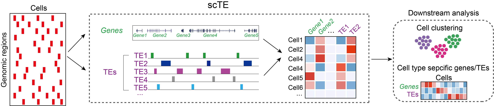

scTE
==============

Quantifying transposable element (TEs) expression from single-cell sequencing data
----------------------------------------------------------------------
[](https://zenodo.org/badge/190696033.svg)

scTE takes as input:

 * Aligned sequence reads (BAM/SAM format)
 * The genomic location of TEs (BED format)
 * The genomic location of genes (GTF format)





Installation
------------
scTE works with python >=3.6.

```bash
$ git clone https://github.com/JiekaiLab/scTE.git
$ cd scTE
$ python setup.py install
```

Usage
-----

**Building genome indices**<br>
scTE builds genome indices for the fast alignment of reads to genes and TEs. These indices can be automatically generated using the commands:

```bash
$ scTE_build -g mm10 # Mouse
$ scTE_build -g hg38 # Human
$ scTE_build -g panTro6 # Chimpanzee
$ scTE_build -g macFas5 # Macaca fascicularis
$ scTE_build -g dm6 # Drosophila melanogaster
$ scTE_build -g danRer11 # Zebrafish
$ scTE_build -g xenTro9 # Xenopus tropicalis
```

These scripts will automatically download the genome annotations, for mouse:

```bash
$ ftp://ftp.ebi.ac.uk/pub/databases/gencode/Gencode_mouse/release_M21/gencode.vM21.annotation.gtf.gz
$ http://hgdownload.soe.ucsc.edu/goldenPath/mm10/database/rmsk.txt.gz
```

Or for human:

```bash
$ ftp://ftp.ebi.ac.uk/pub/databases/gencode/Gencode_human/release_30/gencode.v30.annotation.gtf.gz
$ http://hgdownload.soe.ucsc.edu/goldenPath/hg38/database/rmsk.txt.gz
```

Or for Chimpanzee:

```bash
$ http://ftp.ensembl.org/pub/release-103/gtf/pan_troglodytes/Pan_troglodytes.Pan_tro_3.0.103.gtf.gz
$ https://hgdownload.soe.ucsc.edu/goldenPath/panTro6/database/rmsk.txt.gz
```

Or for Macaca fascicularis:

```bash
$ http://ftp.ensembl.org/pub/release-102/gtf/macaca_fascicularis/Macaca_fascicularis.Macaca_fascicularis_5.0.102.gtf.gz
$ http://hgdownload.soe.ucsc.edu/goldenPath/macFas5/database/rmsk.txt.gz
```

Or for Drosophila melanogaster:

```bash
$ http://ftp.ensembl.org/pub/release-103/gtf/drosophila_melanogaster/Drosophila_melanogaster.BDGP6.32.103.gtf.gz
$ http://hgdownload.soe.ucsc.edu/goldenPath/dm6/database/rmsk.txt.gz
```

Or for Zebrafish:

```bash
$ http://ftp.ensembl.org/pub/release-103/gtf/danio_rerio/Danio_rerio.GRCz11.103.gtf.gz
$ https://hgdownload.soe.ucsc.edu/goldenPath/danRer11/database/rmsk.txt.gz
```

Or for Xenopus tropicalis:

```bash
$ http://ftp.ensembl.org/pub/release-103/gtf/xenopus_tropicalis/Xenopus_tropicalis.Xenopus_tropicalis_v9.1.103.gtf.gz
$ https://hgdownload.soe.ucsc.edu/goldenPath/xenTro9/database/rmsk.txt.gz
```

`mm10, hg38, panTro6, macFas5, dm6, danRer11, xenTro9` is the genome assembly version. 
If you want to use your customs reference, you can use the ` -gene -te` options:

```
scTE_build -te TEs.bed -gene Genes.gtf -o custome

-te
    Six columns bed file for transposable elements annotation.
-gene
    Gtf file for genes annotation. 
```
For more informat about BED and GTF format, see from [UCSC](https://genome.ucsc.edu/FAQ/FAQformat).
These annotations are then processed and converted into genome indices. The scTE algorithm will allocate 
reads first to gene exons, and then to TEs by default. Hence TEs inside exon/UTR regions of genes annotated 
in GENCODE will only contribute to the gene, and not to the TE score. This feature can be changed by 
setting `–mode/-m inclusive` in scTE, which will instruct scTE to assign the reads to both TEs and genes 
if a read comes from a TE inside exon/UTR regions of genes. If you want to remove the TEs inside the intron 
of genes, you can sete `–mode/-m nointron` in scTE

**Analysis of 10x style scRNA-seq data**

scTE makes BAM/SAM file as input, highly recommend to use unfiltered alignment file as input.

For `bam` file generated by [STARsolo](https://github.com/alexdobin/STAR) etc, the cell barcodes and UMI need to be integrated into the read 'CR:Z' or 'UR:Z' tage as bellow:

```bash
$ scTE -i inp.bam -o out -x mm10.exclusive.idx --hdf5 True -CB CR -UMI UR
```
```bash
$ samtools view test.bam
A00269:12:H7YF2DMXX:2	0	chr10	55902580	255	50M	*	0	0	GTTCTCTCCGTATGTGAGCATGGGAGATACATCCCAGAAAGGCAGAAGGG	FFFFFFFFFFFFFFFFFFFFFFFFFFFFFFFFFFFFFFFFFFFFFFFFFF	NH:i:1	HI:i:1	AS:i:49	nM:i:0	CR:Z:CTAGAGTGTTTCGCTC	CY:Z:FFFFFFFFFFFFFFFF	UR:Z:TACATGACGC	UY:Z:FFFFFFFFFF
A00269:13:H7YF2DMXX:2	0	chr10	55902784	255	50M	*	0	0	ATAATCTTTGAGATCTCTGGTGAAAATAAGTAGCATAAAGGACAGAATCA	FFFFFFFFFFFFFFFFFFFFFFFFFFFFFFFFFFFFFFFFFFFFFFFFFF	NH:i:1	HI:i:1	AS:i:49	nM:i:0	CR:Z:CTAGAGTGTTTCGCTC	CY:Z:FFFFFFFFFFFFFFFF	UR:Z:TACATGACGC	UY:Z:FFFFFFFFFF
A00269:14:H7YF2DMXX:2	0	chr13	67837311	255	50M	*	0	0	CTGTTCATTATTTGAGGAAATCAGGACAGGAAATCAAACATGGCAGAATC	FFFFFFFFFFFFFFFFFFFFFFFFFFFFFFFFFFFFFFFFFFFFFFFFFF	NH:i:1	HI:i:1	AS:i:49	nM:i:0	CR:Z:ATCGAGTGTTTCGCTC	CY:Z:FFFFFFFFFFFFFFFF	UR:Z:TACATGACGC	UY:Z:FFFFFFFFFF
A00269:15:H7YF2DMXX:2	0	chr14	114380523	255	50M	*	0	0	GATCCAGATTAATTGAGACTGTTGATCCTCCTACAGGGTCGCCCTTCTCC	FFFFFFFFFFFFFFFFFFFFFFFFFFFFFFFFFFFFFFFFFFFFFFFFFF	NH:i:1	HI:i:1	AS:i:49	nM:i:0	CR:Z:CTAGAGTGTTTCGCTC	CY:Z:FFFFFFFFFFFFFFFF	UR:Z:TACATGACGC	UY:Z:FFFFFFFFFF
```

For `bam` file generated by [Cell Ranger](https://support.10xgenomics.com/single-cell-gene-expression/software/pipelines/latest/what-is-cell-ranger) etc, the cell barcodes and UMI need to be integrated into the read 'CB:Z' or 'UB:Z' tage as bellow:

```bash
$ scTE -i inp.bam -o out -x mm10.exclusive.idx --hdf5 True -CB CB -UMI UB
```
```bash
$ samtools view test.bam
A00519:758:HTCCHDSXY:3:2535:21296:19774	16	chr1	14021	0	90M	*	0	0	TGGATTTCTATCTCCCTGGCTTGGTGCCAGTTCCTCCAAGTCGATGGCACCTCCCTCCCTCTCAACCACTTGAGCAAACTCCAAGACATC	,FFFFFFFFFFFFFFFFFFFFFFFFFFFFF:FFFFFFFFFFFFFFFFFFFFFFFFFFFFFFF:F:FFFFFFFFFFFFFFFFFFF:FFFFF	NH:i:5	HI:i:1	AS:i:88	nM:i:0	RG:Z:SC3_v3_NextGem_DI_CellPlex_Human_PBMC_10K:0:1:HTCCHDSXY:3	RE:A:I	xf:i:0	CR:Z:CTCCCTCCACTGCGAC	CY:Z:FFFFFFFFFFFFFFFF	CB:Z:CTCCCTCCACTGCGAC-1	UR:Z:AAGGCGTAGTAG	UY:Z:FFFFFFFFFFFF	UB:Z:AAGGCGTAGTAG
A00519:758:HTCCHDSXY:1:1355:17237:31720	0	chr1	14260	0	90M	*	0	0	CTCCCTCTCATCCCAGAGAAACAGGTCAGCTGGGAGCTTCTGCCCCCACTGCCTAGGGACCAACAGGGGCAGGAGGCAGTCACTGACCCC	FFFFFFFFFFFFFFFFFFFFFFFFFFFFFFFFFFFFFFFFFFFFFFFFFFFFFFFFFFFFFFFFFFFFFFFFFFFFFFFFFFFFFFFFFF	NH:i:5	HI:i:1	AS:i:88	nM:i:0	RG:Z:SC3_v3_NextGem_DI_CellPlex_Human_PBMC_10K:0:1:HTCCHDSXY:1	RE:A:I	xf:i:0	CR:Z:TCGTCCACAGTATGAA	CY:Z:FFFFFFFFFFFFFFFF	CB:Z:TCGTCCACAGTATGAA-1	UR:Z:GACTTATTTTTT	UY:Z:FFFFFFFFFFFF	UB:Z:GACTTATTTTTT
A00519:758:HTCCHDSXY:3:2227:16703:32080	16	chr1	14411	1	90M	*	0	0	TCAGTTCTTTATTGATTGGTGTGCCGTTTTCTCTGGAAGCCTCTTAAGAACACAGTGGCGCAGGCTGGGTGGAGCCGTCCCCCCATGGAG	FFFFFFFFFFFFFFFFFFFFFFFFFFF:FFFF:FFFFFFFF:FFFFFFFFFFFFFFFFFFFFFFFFFFFFFFFFFFFFFFFFFFFFFFFF	NH:i:3	HI:i:1	AS:i:88	nM:i:0	RG:Z:SC3_v3_NextGem_DI_CellPlex_Human_PBMC_10K:0:1:HTCCHDSXY:3	RE:A:I	xf:i:0	CR:Z:TTGAGTGGTTGTGGCC	CY:Z:FFFFFFFFFFFFFFFF	CB:Z:TTGAGTGGTTGTGGCC-1	UR:Z:TATAATGCTCAG	UY:Z:FFFFFFFFFFFF	UB:Z:TATAATGCTCAG
A00519:758:HTCCHDSXY:3:2563:23665:33802	16	chr1	14411	1	90M	*	0	0	TCAGTTCTTTATTGATTGGTGTGCCGTTTTCTCTGGAAGCCTCTTAAGAACACAGTGGCGCAGGCTGGGTGGAGCCGTCCCCCCATGGAG	FFFFF:FFFFFFFFFFFFFFFFFFFFFFFFFFFFFF:FFFFFFFF:FFFFFFFFFFFFFFFFFFFFFFFFFFFFFFFFFFFFFFFFFFFF	NH:i:3	HI:i:1	AS:i:88	nM:i:0	RG:Z:SC3_v3_NextGem_DI_CellPlex_Human_PBMC_10K:0:1:HTCCHDSXY:3	RE:A:I	xf:i:0	CR:Z:TGTTGAGAGGCAATGC	CY:Z:FFFFFFFFFFFFFFFF	CB:Z:TGTTGAGAGGCAATGC-1	UR:Z:ACGGGTGTGGAG	UY:Z:FFFFFFFFFFFF	UB:Z:ACGGGTGTGGAG
```
```
-i
    Input file: BAM/SAM file from CellRanger or STARsolo
-o
    Output file prefix
-x
    The filename of the index for the reference genome annotation generated by scTE_build
-p
    Number of threads to use, Default: 1. scTE takes ~10Gb memory each thread for human and mouse genome.
--hdf5
    Save the output as .h5ad formatted file instead of csv file. Default: False
```

scTE is most tuned to [STARsolo](https://github.com/alexdobin/STAR) or the [Cell Ranger](https://support.10xgenomics.com/single-cell-gene-expression/software/pipelines/latest/what-is-cell-ranger) pipeline outputs, 
and can accept BAM files produced by either of these two programs. 
For other aligners, the barcode should be stored in the `CR:Z` or `CB:Z` tag, and the UMI in the `UR:Z` or `UB:Z` tag in the BAM file

**Analysis of C1 style scRNA-seq data**<br>
If the UMI is missing or not used in the scRNA-seq technology (for example on the Fluidigm C1 platform), it can be disabled with `–UMI False` 
(the default is True) switch in scTE. If the barcode is missing it can be disabled with the `–CB False` (the default is True), 
and instead the cell barcodes will be taken from the names of the BAM files.

```bash
$ scTE -i inp.bam -o out -x mm10.exclusive.idx -CB False -UMI False
```
multiple BAM files can be provided to scTE with the `–i` option
```
$ scTE -i *.bam -o out -x mm10.exclusive.idx -CB False -UMI False
```
or 
```
$ scTE -i input1.bam,input2.bam,... -o out -x mm10.exclusive.idx -CB False -UMI False
```

**Analysis of scATAC-seq data**<br>
The genome indices were prebuilt using:
```
$ wget -c http://hgdownload.soe.ucsc.edu/goldenPath/mm10/database/rmsk.txt.gz -O mm10.te.txt.gz
$ zcat mm10.te.txt.gz | grep -E 'LINE|SINE|LTR|Retroposon' | cut -f6-8,11 >mm10.te.bed
$ scTEATAC_build -g mm10.te.bed -o mm10.te.atac
```
Then the bam file can processe using scTE with the command:
```
scTEATAC -i input.bam -x mm10.te.atac.idx
```

**Citation**<br>
If scTE is useful for your research, consider citing [Nature Communications (2021)](https://www.nature.com/articles/s41467-021-21808-x)


